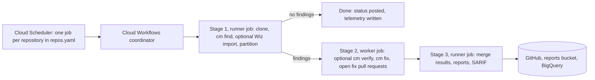

# CodeMender Orchestrator

The CodeMender Orchestrator runs Google CodeMender against your GitHub
repositories from your own Google Cloud project. It finds vulnerabilities,
optionally verifies them, proposes fixes as pull requests, and publishes the
results to GitHub code scanning and BigQuery.

It runs in your Google Cloud project and your GitHub organization: your code
is cloned into Cloud Run jobs that you own, and CodeMender's model calls go to
Vertex AI in your project.

## Who this is for

| Team | Start with |
| --- | --- |
| Platform team (deploys and operates it) | [Before you start](#before-you-start), then the [GitOps guide](docs/guides/gitops_cloud_build.md) and [Operations](docs/operations.md) |
| Security team (reviews it, triages results) | [Security model](#security-model), [Where results show up](#where-results-show-up) and [How it works](docs/how_it_works.md) |
| Application teams (own the scanned repositories) | [Where results show up](#where-results-show-up), [Onboard a repository](#onboard-a-repository) and [Set up pull request scans](#set-up-pull-request-scans-on-a-repository) |

## Which flow do I use?

| You want to | Flow | Runs on |
| --- | --- | --- |
| Scan whole repositories on a schedule and get fix pull requests | **Scheduled scans** (the main flow) | Your Google Cloud project: Cloud Scheduler, Cloud Workflows, Cloud Run jobs |
| Check each pull request for newly introduced vulnerabilities | **Pull request scans** (optional, advisory at first) | GitHub Actions in each repository |
| Change what is scanned, or how the deployment is set up | **GitOps deployment changes** | Cloud Build, triggered by pull requests to your copy of this repository |

Scheduled full-repository scans run on Google Cloud. GitHub Actions is used for
pull request scans only. (The GitHub Actions workflow can also run scheduled
scans, but that is not the supported path in this setup.)

The two scan flows are set up separately, and a repository can use either or
both:

*   **Scheduled scans:** the repository has an entry in `repos.yaml`. See
    [Onboard a repository](#onboard-a-repository).
*   **Pull request scans:** the repository has its own
    `.github/workflows/codemender.yml`. A `repos.yaml` entry does not turn them
    on. See
    [Set up pull request scans on a repository](#set-up-pull-request-scans-on-a-repository).

## How it works

A scheduled scan runs in three stages. Stage 1 clones the repository and runs
`cm find`. If there are findings, Stage 2 runs parallel workers that fix them
and open pull requests. Stage 3 merges the results and publishes them.



[How it works](docs/how_it_works.md) has the detailed diagrams for all three flows,
where the data lives, and the full security model.

## What gets deployed in your project

`<prefix>` is `resource_prefix` from `deployment.yaml` (default `codemender`).

| Resource | Name | Purpose |
| --- | --- | --- |
| Cloud Scheduler jobs | `<prefix>-scan-<name>`, one per entry in `repos.yaml` | Start a scan on the entry's schedule |
| Cloud Workflows workflow | `<prefix>-coordinator` | Runs the three stages in order |
| Cloud Run jobs | `<prefix>-runner` (stages 1 and 3), `<prefix>-worker` (stage 2) | Run the orchestrator and the CodeMender CLI (`cm`) |
| Cloud Storage bucket | `<prefix>-reports-<project>` | Scan workspaces and HTML reports; objects are deleted after 90 days |
| Artifact Registry repository | `<prefix>-runner` | The runner container image |
| Secret Manager secrets | See [Operations](docs/operations.md#github-credentials) | GitHub App private key; optional Wiz credentials |
| BigQuery dataset | `codemender_telemetry` (configurable via `bigquery_dataset_id`; not prefixed with `resource_prefix`) | Scan history and findings, if telemetry is on (the default) |
| Service accounts | `<prefix>-runner-sa`, `<prefix>-worker-sa`, `<prefix>-workflows-sa`, `<prefix>-scheduler-sa` | One identity per component |
| VPC connector and Cloud NAT | optional (`create_vpc_and_nat`) | Fixed egress IP, for example for a GitHub IP allow list |

The one-time GitOps bootstrap adds a Terraform state bucket, three build service
accounts and four Cloud Build triggers; see the
[GitOps guide](docs/guides/gitops_cloud_build.md#what-gets-created).

## Before you start

You need:

*   A **private** copy of this repository on github.com, owned by the team that
    runs the deployment. It holds `repos.yaml`, which can run code in the scan
    jobs. Under Enterprise Managed Users, **internal** is not private enough:
    internal repositories are visible to the whole enterprise.
*   A **dedicated** Google Cloud project with Vertex AI available. Use a
    dedicated project per deployment because the GitOps pipeline's plan and
    apply service accounts hold project-wide roles (see
    [Security model](docs/how_it_works.md#deployment-changes)).
*   Someone who can create and install a GitHub App in your GitHub
    organization.

> [!IMPORTANT]
> Check these with your GitHub and identity administrators first. Any of them
> can stop the deployment from reaching GitHub:
>
> *   **github.com only.** GHE.com (data residency) is not supported by this
>     pipeline.
> *   **IP restrictions.** A GitHub IP allow list, or conditional access
>     policies with IP conditions, can block calls from Google Cloud. Allow the
>     Cloud Build GitHub App, and give the scan jobs a fixed egress IP
>     (`create_vpc_and_nat`) if the allow list applies to them too.
> *   **VPC Service Controls.** Inside a perimeter, Cloud Build needs a private
>     pool, which this setup does not create.

Then follow the [GitOps guide](docs/guides/gitops_cloud_build.md) to bootstrap the
deployment, and [Operations](docs/operations.md#github-credentials) to set up the
GitHub App.

## Set up with the helper

`scripts/setup/codemender-setup` runs those steps for you from Cloud Shell, a
GitHub codespace or your workstation, and shows each change before it makes
it. A first setup, in order:

```bash
scripts/setup/codemender-setup check          # tools, logins, permissions
scripts/setup/codemender-setup init           # deployment.yaml, repos.yaml, bootstrap settings
scripts/setup/codemender-setup connect        # Cloud Build connection (browser steps)
scripts/setup/codemender-setup bootstrap      # state bucket, service accounts, triggers
scripts/setup/codemender-setup secrets github-app --app-id APP_ID --key-file KEY.pem
scripts/setup/codemender-setup add-repo NAME --url https://github.com/ORG/NAME.git --pr
# --pr opens one pull request with deployment.yaml and repos.yaml. Merge it;
# its apply creates the scan jobs. Then `git pull` the merged branch.
scripts/setup/codemender-setup first-image    # build and roll out the runner image
scripts/setup/codemender-setup doctor         # health check; says when to start the schedules
```

Use `--pr` only on that last edit: until both files are committed, `--pr` puts
both in the pull request, and they leave your working tree until you pull the
merge. Later changes can use `--pr` on any edit.

For pull request scans on GitHub Actions, `codemender-setup pr-scans` checks the
runner image, Workload Identity Federation and the runners first; see
[Set up pull request scans on a repository](#set-up-pull-request-scans-on-a-repository).
The [helper's README](scripts/setup/README.md) describes every command.

## Onboard a repository

This sets up scheduled scans. Add an entry to `terraform/gcp/repos.yaml` in a
pull request:

```yaml
repositories:
  example-service:
    repo_url: https://github.com/your-org/example-service.git
    schedule: "0 3 * * 6"   # optional; default is scheduler_cron in deployment.yaml
```

The pull request's Terraform plan shows the new scheduler job. Merge it, and
the job is created. Make sure the GitHub App is installed on the repository.

`repos.example.yaml` lists every supported key (scan directories, branch,
build command, parallelism, extra `cm` flags, dry run, optional Wiz import).

> [!WARNING]
> `build_command` runs inside the scan jobs, which hold GitHub credentials.
> Treat `repos.yaml` changes like code changes and require review from your
> platform or security team (see `.github/CODEOWNERS.example`).

## Set up pull request scans on a repository

Pull request scans run on GitHub Actions in the scanned repository. Its
`.github/workflows/codemender.yml` calls
`.github/workflows/codemender_parallel.yml` in your copy of this repository.

Once for your organization:

1.  **Build the runner image.** See
    [Build the runner image](docs/operations.md#build-the-runner-image).
2.  **Set up Google access.** Copy `terraform/gha_wif/terraform.tfvars.example`
    to `terraform.tfvars`, fill it in, and apply the module from a
    workstation. Applying it needs a GitHub token with admin access to the
    scanning repositories, in the `GITHUB_TOKEN` environment variable (or
    `github_mgmt_token`). It creates the Workload Identity Federation provider
    and a service account with Vertex AI access, and sets the
    `GCP_WORKLOAD_IDENTITY_PROVIDER` and `GCP_SERVICE_ACCOUNT` secrets and the
    `codemender-scan` label in each repository listed in
    `target_github_repositories`. `github_scope_type` decides which
    repositories may use the identity: every repository of `github_owner`, or
    only those in `wif_allowed_repositories`. It keeps its Terraform state in
    that directory unless you add a backend; keep the state, because you apply
    the module again for each new repository.
3.  **Let the scanning repositories call the workflow.** In your copy, under
    **Settings > Actions > General > Access**, allow access from repositories
    in your organization. (Or skip this and pass `--copy-reusable-workflow` in
    step 7, which copies the workflow into each repository; those copies do not
    get later changes to your copy.)
4.  **Agree on runners, container mode, sandbox and egress** with your platform
    team: see [Before pull request scans](docs/operations.md#before-pull-request-scans).

For each repository:

5.  **Give it the secrets.** If the repository is not in
    `target_github_repositories` yet, add it (and to `wif_allowed_repositories`,
    as `ORG/REPO`, if `github_scope_type` is `repositories`) and apply
    `terraform/gha_wif` again, so that it gets the two secrets and the label.
6.  **Check the prerequisites:**

    ```bash
    scripts/setup/codemender-setup pr-scans --image IMAGE --runner-type LABEL --github-repo ORG/REPO
    ```

7.  **Generate the caller workflow**. It is advisory (non-blocking) by default:

    ```bash
    python3 scripts/ci/init_codemender_workflow.py \
      --target-dir /path/to/REPO \
      --agent-repo ORG/YOUR-COPY \
      --runner-image ghcr.io/ORG/codemender-runner:latest
    ```

    This writes `.github/workflows/codemender.yml` in the target repository.
    Add `--gh-repo ORG/REPO` to also create the label and set the repository
    variables with `gh`.
8.  **On self-hosted runners**, add `runner_type: LABEL` under `with:` in the
    generated file. The generator does not set it, and the default is
    `ubuntu-latest`.
9.  **Open a pull request** in the target repository with the new file. That
    pull request changes no source files, so it skips the scan; it confirms
    that the workflow and the image work and posts a passing
    `CodeMender / Security Gate` status. Pull requests that change source files
    get the scan: a summary comment, inline fix suggestions for what it finds,
    and the status.
10. **Turn on blocking** once the team trusts the results: set repository
    variable `CODEMENDER_BLOCK_PR_MERGE` to `true`, and require
    `CodeMender / Security Gate` in a branch ruleset. Setting the variable back
    to `false` returns to advisory mode; neither change needs the workflow to be
    regenerated.

Without a GitHub App, the workflow uses the repository's `GITHUB_TOKEN`. To use
an App instead, install it on the repository and set the `GH_APP_ID` and
`GH_APP_PRIVATE_KEY` secrets (`terraform/gha_wif` sets `GH_APP_ID` when you
give it `github_app_id`).

> [!NOTE]
> A workflow generated by an earlier version of the generator ignores
> `CODEMENDER_BLOCK_PR_MERGE=false`. Regenerate it with `--force` so that the
> variable works in both directions. Earlier versions also blocked by default:
> if that workflow was blocking and `CODEMENDER_BLOCK_PR_MERGE` is not set to
> `true`, add `--blocking` (or set the variable) to keep it blocking.

The [GitHub Actions Pre-Submit CI/CD Onboarding Guide](docs/guides/github_actions_presubmit_ci_cd.md)
has every generator flag, workflow input and secret, and how blocking and
advisory modes behave.

## Where results show up

For each scheduled scan:

| Where | What |
| --- | --- |
| Pull requests in the scanned repository | One fix pull request per fixed finding, opened by the GitHub App's bot account |
| GitHub commit status on the scanned commit | `CodeMender / Nightly Scan`. Informational; it never blocks anything |
| GitHub Security tab (code scanning) | The findings, as SARIF |
| Reports bucket | An HTML report at `reports/<owner>_<repo>/<scan-id>/` (only for scans with findings) |
| BigQuery | Tables `scan_runs` and `vulnerability_findings`, and views `v_findings_enriched`, `v_scan_runs_flat` and `v_token_usage` |
| Cloud Workflows | The execution history of `<prefix>-coordinator`; each GitHub status links to its execution |

Known gaps:

*   **A clean scan does not clear existing Security-tab alerts.** When a
    scheduled scan finds nothing, no SARIF file is uploaded, so alerts from
    earlier scans stay open until they are dismissed or a later scan with
    findings replaces them. (The orchestrator has an option to upload an empty
    SARIF file, but this deployment does not set it and `repos.yaml` and
    `deployment.yaml` do not expose it.)
*   **No alerting is set up.** The deployment creates no Cloud Monitoring alert
    policies. Watch for failed `<prefix>-coordinator` executions, or add an
    alert on them yourself.

Pull request scans report differently; see
[How it works](docs/how_it_works.md#pull-request-scans-github-actions).

## Reprocess findings from BigQuery

`codemender_bigquery_roundtrip.py` imports the latest actionable findings for
one repository from `vulnerability_findings`, skips findings already present in
the local CodeMender state, and runs `cm verify` followed by `cm fix` for
verified findings. It merges the resulting state into
`current_findings_by_id`, keyed by `(repository, finding_id)`. The
historical `vulnerability_findings` table is not modified.

Run it from the repository root with Application Default Credentials that can
read the source table and create/update tables in the dataset, plus a local
CodeMender checkout and installed `cm` binary:

```bash
python3 codemender_bigquery_roundtrip.py \
    --repository your-org/your-repo \
    --repo-dir /path/to/checkout \
    --project your-gcp-project \
    --dataset codemender_telemetry \
    --dry-run
```

Remove `--dry-run` to import, verify, fix and upload the findings. Project and
dataset can instead come from `CODEMENDER_BQ_PROJECT` and
`CODEMENDER_BQ_DATASET` (or the ambient Google Cloud project).

## Security model

*   **GitHub access through a GitHub App.** The App has only the repository
    permissions the scans need, and the jobs mint one-hour installation tokens
    from its private key at run time. Fix pull requests are attributed to the
    App's bot account, not a person.
*   **Secrets live only in Secret Manager.** `repos.yaml` and `deployment.yaml`
    only name secrets. The GitHub App key and the Wiz credentials are
    referenced, not managed, by Terraform, so they never enter Terraform state.
*   **One service account per component.** The worker (stage 2) has no access
    to the reports bucket: it reads its inputs and writes its results through
    short-lived signed URLs. The worker does hold the GitHub App credentials
    (it pushes fix branches) and Vertex AI access (it runs `cm`). Only the
    runner writes to BigQuery.
*   **Credentials are removed from `cm`'s environment.** Before it runs `cm`,
    the orchestrator removes the GitHub tokens and App settings (`GH_APP_*`,
    `GITHUB_APP_*`), the Wiz credentials, any service account key variables
    and the GitHub Actions runtime and OIDC request tokens from the
    environment. `cm` keeps `GOOGLE_APPLICATION_CREDENTIALS`, which is how it
    reaches Vertex AI. On Cloud Run, the job's own service account is still
    reachable through the metadata server, which is why `build_command` needs
    review (below).
*   **Sandboxing.** On Cloud Run, the CodeMender CLI's own sandbox is turned off
    (`CODEMENDER_SANDBOX_ENABLED=false`), and the jobs rely on Cloud Run's
    container isolation. In the GitHub Actions pull request flow, the sandbox is
    on by default and the jobs run in privileged containers. The workflow keeps
    the Google credentials file outside the files the sandbox can reach. A `cm`
    session whose sandbox cannot start is not run unsandboxed: the scan fails
    (so the security gate fails) and the finding is marked unverified, unless
    you set the workflow input `allow_unsandboxed_fallback: true`.
*   **Deployment changes go through pull requests.** Pull request plans run as
    a read-only identity that cannot read secrets or findings. A change that
    would delete a bucket, dataset, secret or the image registry stops before
    applying and needs a separate, approved build.
*   **`repos.yaml` is code.** A repository's `build_command` runs in the scan
    jobs and can use their service account, which can read the GitHub App key.
    Require code owner review for it and keep your copy private.

The full model is in [How it works](docs/how_it_works.md#security-model).

## Versions

Scans run the latest CodeMender CLI release: each image build downloads it, and
each scheduled scan updates it when it starts. The download is public. To hold
one release, or to try a release without affecting scheduled scans, see
[Operations](docs/operations.md#codemender-cli-version).

## Documentation

*   [How it works](docs/how_it_works.md): the three flows with diagrams, where data
    lives, and the security model.
*   [GitOps with Cloud Build](docs/guides/gitops_cloud_build.md): the one-time
    bootstrap, and how pull requests plan, apply and roll out changes.
*   [GitHub Actions Pre-Submit CI/CD Onboarding Guide](docs/guides/github_actions_presubmit_ci_cd.md):
    how to generate `.github/workflows/codemender.yml` (`scripts/ci/init_codemender_workflow.py`)
    and configure blocking vs. non-blocking Pull Request security gates.
*   [Operations](docs/operations.md): onboarding and offboarding repositories,
    `deployment.yaml` settings, GitHub App and Wiz secrets, building the
    runner image for pull request scans, reading results, and troubleshooting.
*   `terraform/gcp/repos.example.yaml` and
    `terraform/gcp/deployment.example.yaml`: every configuration key, with
    defaults.
