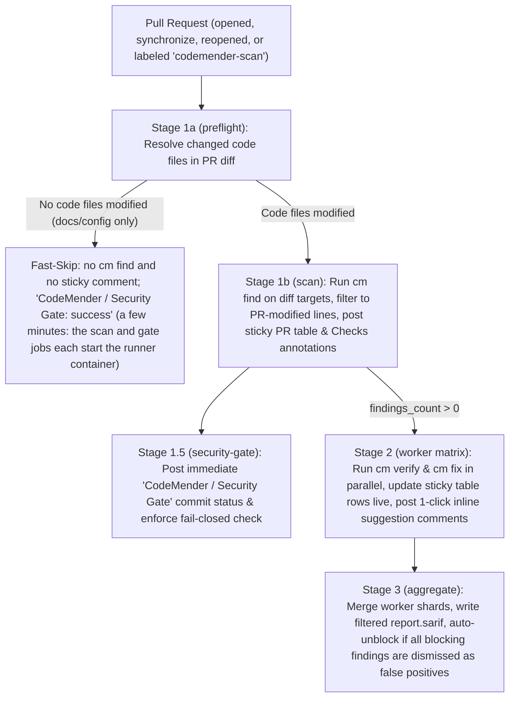

# GitHub Actions Pre-Submit CI/CD Onboarding Guide

This guide explains how to consume the CodeMender Orchestrator in GitHub Actions
for **Pull Request Pre-Submit CI/CD**, how to generate
`.github/workflows/codemender.yml` using the included startup script
([`scripts/ci/init_codemender_workflow.py`](../../scripts/ci/init_codemender_workflow.py)),
and how to configure **Blocking** vs. **Non-Blocking (Advisory)** security gate
modes.

--------------------------------------------------------------------------------

## 1. Architecture: The 4-Stage Pre-Submit Security Gate

When `CODEMENDER_PRESUBMIT_PIPELINE: "true"` is active, the orchestrator runs a
4-stage Pull Request pipeline designed for fast developer feedback, automatic
false-positive filtering, and one-click inline patch suggestions:



| Stage | Job Name | `CODEMENDER_RUN_MODE` | Responsibility |
| :--- | :--- | :--- | :--- |
| **Stage 1a** | `scan` | `preflight` | Computes `git diff` against the PR base branch and resolves modified source code directories. Short-circuits (`skip_scan=true`) on documentation-only or configuration-only PRs. |
| **Stage 1b** | `scan` | `scan` | Runs `cm find` on the target paths, filters findings to lines touched by the PR diff (plus 1-hop callers), posts the initial sticky PR summary comment, and emits GitHub Checks annotations (`::error` or `::warning`). |
| **Stage 1.5** | `security-gate` | `gate` | Evaluates the Stage 1 scan result immediately. Fails closed (`error` status) if Stage 1 failed or was cancelled, or posts the initial `CodeMender / Security Gate` commit status (`failure` in blocking mode when blocking findings exist; `success` in non-blocking mode or when 0 blocking findings exist). |
| **Stage 2** | `worker` | `worker` | Parallel worker matrix (`0..N-1`). Runs `cm verify` to filter false positives, runs `cm fix` on confirmed findings, posts one-click inline ` ```suggestion ` review comments on the PR diff, and updates each finding's row in the sticky PR comment in real time. |
| **Stage 3** | `aggregate` | `aggregate` | Collects all worker shards, writes a filtered `report.sarif` (excluding dismissed false positives) for GitHub Code Scanning, updates the sticky PR comment and Step Summary with final verdicts, and **auto-unblocks** the `CodeMender / Security Gate` commit status to `success` if all blocking findings were dismissed as false positives. |

--------------------------------------------------------------------------------

## 2. Quickstart: Generate `.github/workflows/codemender.yml`

Use the startup script
[`scripts/ci/init_codemender_workflow.py`](../../scripts/ci/init_codemender_workflow.py)
(or its shell wrapper
[`scripts/ci/init_codemender_workflow.sh`](../../scripts/ci/init_codemender_workflow.sh))
to generate `.github/workflows/codemender.yml` in your target repository.

### Option A: Reusable Workflow Mode (Recommended for Same-Org Repositories)

Generates a concise `.github/workflows/codemender.yml` that calls
[`.github/workflows/codemender_parallel.yml`](../../.github/workflows/codemender_parallel.yml)
and runs inside your organization's `codemender-runner` container image:

```bash
python3 scripts/ci/init_codemender_workflow.py \
  --target-dir /path/to/target-repo \
  --mode reusable \
  --agent-repo your-org/codemender-agent \
  --agent-ref main \
  --runner-image ghcr.io/your-org/codemender-runner:latest \
  --scan-target "src" \
  --min-blocking-severity MEDIUM
```

*   **Advisory (Non-Blocking) by Default**: The generated workflow defaults to
    `block_pr_merge: false`, so findings and inline suggestions are posted
    without failing PR checks during initial rollout. Turn blocking on later
    with the `CODEMENDER_BLOCK_PR_MERGE` repository variable (see §3.2); no
    regeneration is needed. To generate a workflow that blocks by default
    instead, pass `--blocking`:

    ```bash
    python3 scripts/ci/init_codemender_workflow.py \
      --target-dir /path/to/target-repo \
      --mode reusable \
      --agent-repo your-org/codemender-agent \
      --blocking
    ```

*   **Callers That Cannot Reach the Agent Repository's Workflow**: A private
    repository can call a reusable workflow in another private repository of
    the same owner once the agent repository allows it under **Settings >
    Actions > General > Access** (`Accessible from repositories owned by
    '<owner>'`; for a personal account, `... owned by '<user>' user`). GitHub
    only grants that access to private callers, so a **public** caller, or a
    setup where you cannot change that setting, needs
    `--copy-reusable-workflow`, which also copies `codemender_parallel.yml`
    into the target repository's `.github/workflows/` directory and references
    it locally (`uses: ./.github/workflows/codemender_parallel.yml`):

    ```bash
    python3 scripts/ci/init_codemender_workflow.py \
      --target-dir /path/to/target-repo \
      --mode reusable \
      --copy-reusable-workflow \
      --runner-image ghcr.io/your-org/codemender-runner:latest
    ```

### Option B: Standalone Orchestrator Mode (No Custom Container Image Required)

Generates a self-contained 4-job `.github/workflows/codemender.yml` (`scan`,
`security-gate`, `worker`, `aggregate`) that runs on standard `ubuntu-latest`
runners, checks out the orchestrator into `.codemender_agent`, installs the `cm`
CLI, and delegates each stage to `python3 .codemender_agent/orchestrator.py`:

```bash
python3 scripts/ci/init_codemender_workflow.py \
  --target-dir /path/to/target-repo \
  --mode standalone \
  --agent-repo your-org/codemender-agent \
  --agent-ref main \
  --scan-target "src" \
  --min-blocking-severity MEDIUM
```

*   **Cross-Namespace Private Orchestrator Fallback (`--vendor-ref`)**: If the
    target repository is in a separate GitHub namespace from a private
    orchestrator repository and `CUSTOM_GITHUB_TOKEN` is not configured, pass
    `--vendor-ref <branch-or-tag>` to configure `CODEMENDER_VENDOR_REF` so the
    checkout step automatically falls back to a mirrored orchestrator ref in the
    target repository.

### Optional: Configure GitHub Labels & Repository Variables Automatically

Pass `--gh-repo <owner>/<repo>` (requires the GitHub CLI `gh` to be authenticated)
to automatically create the `codemender-scan` PR trigger label and configure the
`CODEMENDER_BLOCK_PR_MERGE` (set to the generated mode: `false` unless
`--blocking`) and `CODEMENDER_MIN_BLOCKING_SEVERITY` repository variables:

```bash
python3 scripts/ci/init_codemender_workflow.py \
  --target-dir /path/to/target-repo \
  --mode reusable \
  --agent-repo your-org/codemender-agent \
  --gh-repo your-org/target-repo
```

### Startup Script CLI Flags Reference (`init_codemender_workflow.py`)

| Flag | Default | Description |
| :--- | :--- | :--- |
| `--target-dir <path>` | `.` | Path to the target repository root where `.github/workflows/codemender.yml` will be written. |
| `--mode {reusable,standalone}` | `reusable` | `reusable` calls `codemender_parallel.yml`; `standalone` generates the 4-job `orchestrator.py` workflow on `ubuntu-latest`. |
| `--agent-repo <owner/repo>` | `your-org/codemender-agent` | GitHub `owner/repo` hosting the CodeMender orchestrator. |
| `--agent-ref <ref>` | `main` | Git branch, tag, or SHA of the CodeMender orchestrator repository. |
| `--vendor-ref <ref>` | None | Optional mirrored branch or tag in the caller repository used as a fallback when cloning the orchestrator in `standalone` mode. |
| `--runner-image <uri>` | `ghcr.io/<owner>/codemender-runner:latest` | Container runner image used in `reusable` mode. |
| `--scan-target <paths>` | `.` | Default directory or comma-separated path(s) to scan when not diff-scoped. |
| `--build-command <cmd>` | Auto-detected | Build/test command passed to `cm fix` (pass `""` to disable custom build command). |
| `--min-blocking-severity` | `MEDIUM` | Minimum severity (`CRITICAL`, `HIGH`, `MEDIUM`, `LOW`) that blocks PR merges. |
| `--blocking` (alias `--block-pr-merge`) / `--non-blocking` | `--non-blocking` | Literal default the workflow falls back to when neither a manual-run input nor `CODEMENDER_BLOCK_PR_MERGE` is set: blocking (`true`) or non-blocking advisory (`false`). `--non-blocking` is the default and is kept for compatibility. |
| `--max-tasks <int>` | `10` | Maximum parallel Stage 2 worker shards. |
| `--copy-reusable-workflow` | `false` | In `reusable` mode, also copy `codemender_parallel.yml` into the target repository's `.github/workflows/` directory. |
| `--gh-repo <owner/repo>` | None | Configure the `codemender-scan` label and `CODEMENDER_BLOCK_PR_MERGE` / `CODEMENDER_MIN_BLOCKING_SEVERITY` repo variables via `gh`. |
| `--force` | `false` | Overwrite an existing `.github/workflows/codemender.yml`. |

--------------------------------------------------------------------------------

## 3. Required Secrets, Repository Variables & Permissions

### 3.1 GitHub Actions Secrets (`Settings > Secrets and variables > Actions > Secrets`)

Configure these secrets on the target repository (or as Organization Secrets):

| Secret Name | Required | Purpose |
| :--- | :--- | :--- |
| `GCP_WORKLOAD_IDENTITY_PROVIDER` | Yes (with WIF) | Google Cloud Workload Identity Provider resource name (`projects/<num>/locations/global/workloadIdentityPools/<pool>/providers/<provider>`). |
| `GCP_SERVICE_ACCOUNT` | Yes (with WIF) | Google Cloud Service Account email with `roles/aiplatform.user` (`<sa>@<project>.iam.gserviceaccount.com`). |
| `GCP_SA_KEY` | Alternative to WIF | Optional JSON service account key if Workload Identity Federation is not used. |
| `GH_APP_ID` | Recommended | GitHub App ID used to mint 60-minute repository installation tokens. |
| `GH_APP_PRIVATE_KEY` | Recommended | GitHub App PEM private key used to mint installation tokens. |
| `CUSTOM_GITHUB_TOKEN` | Optional | Personal Access Token or fine-grained token fallback (also used in `standalone` mode when cloning a private orchestrator repository across organizations). |

> [!TIP]
> The Terraform module in `terraform/gha_wif/` can provision the Google Cloud
> Workload Identity Pool, Service Account, `codemender-scan` label, and
> non-sensitive repository secrets automatically.

### 3.2 GitHub Repository Variables (`Settings > Secrets and variables > Actions > Variables`)

You can toggle blocking behavior and severity thresholds **at any time without
modifying `.github/workflows/codemender.yml`** by setting these optional
repository variables:

| Variable Name | Values | Default | Behavior |
| :--- | :--- | :--- | :--- |
| `CODEMENDER_BLOCK_PR_MERGE` | `true` \| `false` (case-insensitive) | Unset: the generated default applies (`false`, or `true` with `--blocking`) | When `true`, findings at or above `CODEMENDER_MIN_BLOCKING_SEVERITY` post `CodeMender / Security Gate: failure` and exit non-zero. When `false`, the pipeline runs in **Non-Blocking (Advisory) Mode**: findings and inline suggestions are still posted, sticky comment rows display `⚠️ **Non-Blocking**`, and `CodeMender / Security Gate` posts `success`. Works in both directions regardless of the generated default. Other values are ignored. |
| `CODEMENDER_MIN_BLOCKING_SEVERITY` | `CRITICAL`, `HIGH`, `MEDIUM`, `LOW` | `MEDIUM` | Minimum severity threshold classified as gate-blocking vs. informational (`ℹ️ Advisory`). |

The generated workflow resolves `block_pr_merge` (and `fail_on_findings`, which
always matches it) in this order, first match wins:

1.  The `block_pr_merge` input of a manual run (`workflow_dispatch`), when set
    to `true` or `false`. It defaults to `auto`, which skips this step; pull
    request runs have no input.
2.  `CODEMENDER_BLOCK_PR_MERGE`, when set to `true` or `false`.
3.  In `standalone` mode only, the legacy `CODEMENDER_FAIL_ON_FINDINGS`
    variable, when set to `true` or `false`.
4.  The default baked in by the generator (`false` unless `--blocking`).

Set or update them via the GitHub CLI:

```bash
gh variable set CODEMENDER_BLOCK_PR_MERGE --repo your-org/target-repo --body "true"
gh variable set CODEMENDER_MIN_BLOCKING_SEVERITY --repo your-org/target-repo --body "MEDIUM"
```

> [!NOTE]
> In `reusable`-mode workflows generated by earlier versions of the generator,
> a `false` value (variable or manual-run input) fell through to the generated
> default, so the variable could only turn blocking on. Regenerate them with
> `--force` to get the behavior above. Earlier versions also generated a
> blocking default, so add `--blocking` when regenerating (or set
> `CODEMENDER_BLOCK_PR_MERGE=true`) if the workflow should keep blocking.

### 3.3 Required Workflow Permissions

Every `.github/workflows/codemender.yml` caller workflow requires:

```yaml
permissions:
  id-token: write         # Google Cloud Workload Identity Federation OIDC token exchange
  contents: write         # Repository checkout and remediation branch management
  pull-requests: write    # Sticky PR summary comment and 1-click inline review suggestions
  security-events: write  # Uploading report.sarif to GitHub Code Scanning
  statuses: write         # Posting the 'CodeMender / Security Gate' commit status check
  actions: read           # Downloading transit artifacts across stages
  packages: read          # Pulling the runner container image from GHCR (reusable mode)
```

--------------------------------------------------------------------------------

## 4. Reference `.github/workflows/codemender.yml` Templates

### 4.1 Template A: Reusable Workflow Caller (`reusable` mode)

Use this template when calling
[`.github/workflows/codemender_parallel.yml`](../../.github/workflows/codemender_parallel.yml)
within the same GitHub organization:

```yaml
name: CodeMender Pre-Submit Security Gate

on:
  pull_request:
    types: [opened, reopened, synchronize, labeled]
  workflow_dispatch:
    inputs:
      scan_target:
        description: 'Subdirectory or file path(s) to scan (default: .)'
        required: false
        default: '.'
        type: string
      build_command:
        description: 'Custom build/test command executed by cm fix'
        required: false
        default: ''
        type: string
      min_blocking_severity:
        description: 'Minimum vulnerability severity that blocks merging (CRITICAL, HIGH, MEDIUM, LOW)'
        required: false
        default: 'MEDIUM'
        type: string
      block_pr_merge:
        description: 'Block PR merge on findings >= min_blocking_severity. auto = use repository variable CODEMENDER_BLOCK_PR_MERGE, else the generated default (false)'
        required: false
        default: 'auto'
        type: choice
        options:
          - 'auto'
          - 'true'
          - 'false'

permissions:
  id-token: write
  contents: write
  pull-requests: write
  security-events: write
  statuses: write
  actions: read
  packages: read

jobs:
  security-gate:
    if: >-
      github.event_name == 'workflow_dispatch' ||
      (github.event_name == 'pull_request' && (
        contains(github.event.pull_request.labels.*.name, 'codemender-scan') ||
        github.event.action == 'opened' ||
        github.event.action == 'reopened' ||
        github.event.action == 'synchronize'
      ))
    uses: your-org/codemender-agent/.github/workflows/codemender_parallel.yml@main
    with:
      runner_image: 'ghcr.io/your-org/codemender-runner:latest'
      scan_target: ${{ inputs.scan_target || '.' }}
      build_command: ${{ inputs.build_command || '' }}
      max_tasks: 10
      min_blocking_severity: ${{ inputs.min_blocking_severity || vars.CODEMENDER_MIN_BLOCKING_SEVERITY || 'MEDIUM' }}
      block_pr_merge: ${{ fromJSON(inputs.block_pr_merge == 'true' && 'true' || inputs.block_pr_merge == 'false' && 'false' || vars.CODEMENDER_BLOCK_PR_MERGE == 'true' && 'true' || vars.CODEMENDER_BLOCK_PR_MERGE == 'false' && 'false' || 'false') }}
      fail_on_findings: ${{ fromJSON(inputs.block_pr_merge == 'true' && 'true' || inputs.block_pr_merge == 'false' && 'false' || vars.CODEMENDER_BLOCK_PR_MERGE == 'true' && 'true' || vars.CODEMENDER_BLOCK_PR_MERGE == 'false' && 'false' || 'false') }}
    secrets:
      gcp_workload_identity_provider: ${{ secrets.GCP_WORKLOAD_IDENTITY_PROVIDER }}
      gcp_service_account: ${{ secrets.GCP_SERVICE_ACCOUNT }}
      gcp_sa_key: ${{ secrets.GCP_SA_KEY }}
      github_app_id: ${{ secrets.GH_APP_ID }}
      github_app_private_key: ${{ secrets.GH_APP_PRIVATE_KEY }}
      custom_github_token: ${{ secrets.CUSTOM_GITHUB_TOKEN }}
```

### 4.2 Reusable Workflow Inputs Reference (`codemender_parallel.yml`)

| Input | Type | Default | Description |
| :--- | :--- | :--- | :--- |
| `runner_image` | `string` | (required for orgs) | Container image with language toolchains and `/usr/local/bin/cm` (built via [`.github/workflows/build_runner_image.yml`](../../.github/workflows/build_runner_image.yml)). |
| `runner_type` | `string` | `'ubuntu-latest'` | GitHub Actions runner label. |
| `scan_target` | `string` | `'.'` | Subdirectory path(s) to scan when not diff-scoped. |
| `build_command` | `string` | `''` | Build/test command used by `cm fix` to validate generated patches. Auto-detected if empty. |
| `max_tasks` | `number` | `10` | Maximum parallel Stage 2 worker matrix shards. |
| `block_pr_merge` | `boolean` | `true` | Block PR merge when findings $\ge$ `min_blocking_severity` remain unfixed. Set `false` for non-blocking audit mode. Generated callers always pass it explicitly (advisory unless generated with `--blocking` or overridden by `CODEMENDER_BLOCK_PR_MERGE`). |
| `fail_on_findings` | `boolean` | `true` | Alias synchronized with `block_pr_merge` controlling non-zero exit code and commit status state. |
| `min_blocking_severity` | `string` | `'MEDIUM'` | Severity threshold (`CRITICAL`, `HIGH`, `MEDIUM`, `LOW`) that triggers blocking behavior. |
| `pr_remediation_mode` | `string` | `'review_suggestion'` | `review_suggestion` posts 1-click inline suggestions on the PR diff; `child_pr` opens a Child Pull Request against the PR branch. |
| `skip_verify` | `boolean` | `true` | Skip `cm verify` on non-presubmit runs (Note: in `CODEMENDER_PRESUBMIT_PIPELINE="true"` mode, Stage 2 workers always run `cm verify` to filter false positives). |
| `skip_exploit_verification` | `boolean` | `false` | Pass `--skip-exploit-verification` to `cm verify`. |
| `sandbox_enabled` | `boolean` | `true` | Enable `cm` process and mount namespace sandbox isolation. Accesses the sandbox blocks are logged; they never cause an unsandboxed rerun. |
| `allow_unsandboxed_fallback` | `boolean` | `false` | If a `cm` session's sandbox cannot start at all, re-run it with `--unrestricted` (with a warning and a step summary line) instead of failing the scan and marking verification unverified. Leave `false` unless your security team accepts running LLM-generated code without the sandbox. |
| `upload_sarif` | `boolean` | `true` | Upload `report.sarif` to GitHub Code Scanning. |
| `dry_run` | `boolean` | `false` | Run scan, verify, and fix without writing comments, statuses, or SARIF to GitHub. |
| `model` / `find_model` / `verify_model` / `fix_model` | `string` | `''` | Optional model overrides across all stages or per individual stage. |

--------------------------------------------------------------------------------

## 5. Blocking vs. Non-Blocking (Advisory) Gate Behavior

The table below summarizes how the 4-stage pipeline behaves across all Pull
Request scenarios in **Blocking Mode** (`block_pr_merge: true`) vs.
**Non-Blocking Mode** (`block_pr_merge: false`):

| Scenario | PR Diff Contents | Blocking Mode (`block_pr_merge: true`) | Non-Blocking Mode (`block_pr_merge: false`) |
| :--- | :--- | :--- | :--- |
| **1. Non-Code PR** | Markdown, docs, or `.github/` changes only | `scan` skips `cm find` and posts no sticky comment; `CodeMender / Security Gate` = `success`. Still takes a few minutes, because the `scan` and `security-gate` jobs each start the runner container. | Identical (`scan` skips `cm find`; no sticky comment; `CodeMender / Security Gate` = `success`). |
| **2. Confirmed Vulnerability ($\ge$ `min_blocking_severity`)** | Confirmed `CRITICAL`, `HIGH`, or `MEDIUM` finding | Sticky comment shows `🚫 **BLOCKED**` and `🚫 **BLOCKING**` in the `Gate` column across all stages; 1-click inline ` ```suggestion ` posted; `CodeMender / Security Gate` = `failure`. | Sticky comment shows `✅ **PASSED (Non-Blocking Mode)**` and `⚠️ **Non-Blocking**` in the `Gate` column across all stages; 1-click inline ` ```suggestion ` posted; `CodeMender / Security Gate` = `success`. |
| **3. Advisory Finding Only ($<$ `min_blocking_severity`)** | Only `LOW` findings when `min_blocking_severity: MEDIUM` | Sticky comment shows `ℹ️ Advisory`; `CodeMender / Security Gate` = `success`; Stage 2 still verifies and posts inline fix suggestions. | Sticky comment shows `ℹ️ Advisory`; `CodeMender / Security Gate` = `success`; Stage 2 still verifies and posts inline fix suggestions. |
| **4. False Positive Auto-Unblock** | Initial `HIGH` finding dismissed by Stage 2 `cm verify` | Stage 1.5 initially posts `failure`; Stage 2 updates row to `⚪ Dismissed (FP)`; Stage 3 excludes it from `report.sarif` and **auto-unblocks** `CodeMender / Security Gate` to `success`. | Stage 1.5 and Stage 3 both post `CodeMender / Security Gate` = `success`; Stage 2 updates row to `⚪ Dismissed (FP)`. |
| **5. Cancelled or Infrastructure Error** | Stage 1 cancelled or crashes before completion, or the `cm` sandbox cannot start (and `allow_unsandboxed_fallback` is `false`) | Stage 1.5 fails closed and posts `CodeMender / Security Gate` = `error` (`exit 1`). | Stage 1.5 fails closed and posts `CodeMender / Security Gate` = `error` (`exit 1`). |
| **6. Remediation Applied** | Developer commits the inline ` ```suggestion ` fix | Concurrency cancels stale run; new scan finds 0 issues, uploads clean SARIF, and posts `CodeMender / Security Gate` = `success`. | Concurrency cancels stale run; new scan finds 0 issues, uploads clean SARIF, and posts `CodeMender / Security Gate` = `success`. |

--------------------------------------------------------------------------------

## 6. Enforcing the Security Gate in GitHub Branch Rulesets

1.  **Roll out in Advisory Mode first**: The generated workflow is advisory by
    default, so leave `CODEMENDER_BLOCK_PR_MERGE` unset (or set it to `false`)
    and do not add `CodeMender / Security Gate` as a required check yet.
    Developers see the sticky PR comment and one-click inline suggestions
    without merges being blocked.
2.  **Enable Blocking Mode**: Set `CODEMENDER_BLOCK_PR_MERGE=true` (no
    regeneration needed) and configure a GitHub Repository Ruleset
    (**Settings > Rules > Rulesets > New branch ruleset**):
    *   **Target branches**: Default branch (`main` / `master`) or release branches.
    *   **Require status checks to pass**: Enable and add
        **`CodeMender / Security Gate`**.
