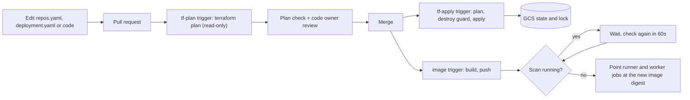

# GitOps with Cloud Build

This guide sets up a CodeMender deployment that is managed entirely through
pull requests. Nobody runs Terraform by hand after the one-time setup:

*   Every pull request gets a `terraform plan` check.
*   Merging runs `terraform apply`. It stops before deleting data.
*   Merging a code change builds a new runner image and rolls it out once no
    scan is running.

The settings live in two committed files in `terraform/gcp/`: `repos.yaml`
(what to scan) and `deployment.yaml` (how the deployment is set up). See
`repos.example.yaml` and `deployment.example.yaml`.



## What gets created

The one-time bootstrap stack (`terraform/bootstrap/`) creates:

| Resource | Purpose |
| --- | --- |
| `<prefix>-tfstate-<project>` bucket | Terraform state for `terraform/gcp`. Versioned, uniform access, public access blocked. |
| `<prefix>-tf-plan` service account | Runs the pull request plan. Read-only; see [Security model](#security-model). |
| `<prefix>-tf-apply` service account | Runs the apply. |
| `<prefix>-image-build` service account | Builds and rolls out the runner image. |
| `<prefix>-tf-plan` trigger | Every pull request into the deployed branch. No file filter, so the check always reports. |
| `<prefix>-tf-apply` trigger | Every push to the deployed branch. Applies automatically unless `apply_requires_approval = true`. |
| `<prefix>-tf-apply-destroy` trigger | Manual only, always needs approval. The only way to apply a change that deletes protected resources. |
| `<prefix>-image` trigger | Pushes that change the image or its rollout (`Dockerfile`, `codemender_agent/**`, `orchestrator.py`, `requirements.txt`, `cloudbuild.yaml`, `scripts/ci/image_rollout.sh`, `scripts/ci/stage_cm.sh`). Builds without approval unless `image_requires_approval = true`. |

The pipeline logic lives in plain scripts under `scripts/ci/`, so the same
steps can run from another CI system (see [GitHub Actions
fallback](#github-actions-fallback)).

## Before you start

*   A **private** copy of this repository on github.com. Never use a public
    repository: `repos.yaml` can run code in the scan jobs (a repository's
    `build_command`), and pull request plans read Terraform state, so the
    repository must not be editable or visible beyond the team that owns the
    deployment. With Enterprise Managed Users, an **internal** repository is
    visible to everyone in the enterprise, so it does not meet this either.
*   Someone who can install a GitHub App on that repository (an organization
    owner, or the repository owner for a personal account).
*   A **dedicated** Google Cloud project for the deployment (the pipeline's plan
    and apply service accounts hold project-wide roles; see [Security
    model](#security-model)), and for the one-time setup an account with
    Owner, or with Project IAM Admin, Service Account Admin, Service Account
    User, Service Usage Admin, Storage Admin, Role Administrator, Cloud Build
    Editor and Cloud Build Connection Admin (`roles/cloudbuild.connectionAdmin`,
    for step 1). If the Cloud Build connection lives in another project, the
    account needs Cloud Build Connection Admin there too.
*   `gcloud` and Terraform 1.11 or later on the machine that runs the bootstrap.
    (The bootstrap itself works with 1.7, but `terraform/gcp` needs 1.11 for any
    local plan, state move or break-glass work.)

> [!IMPORTANT]
> Check these with your GitHub and identity administrators first. Any of them
> can stop Cloud Build from reaching GitHub:
>
> *   **GHE.com (data residency):** Cloud Build triggers on a GHE.com
>     connection are not documented. This pipeline supports github.com only.
> *   **IP restrictions:** Entra ID conditional access policies with IP
>     conditions, or a GitHub IP allow list, can block calls from Google's IP
>     ranges. The Cloud Build GitHub App must be allowed.
> *   **VPC Service Controls:** inside a perimeter, the builds need a Cloud Build
>     private pool, which this setup does not create.

## Step 1: Connect the repository to Cloud Build (once, by hand)

This needs a browser login and a GitHub App installation, so it is not
automated. Use the same region for the connection, the triggers and (normally)
the deployment.

```bash
export PROJECT_ID=your-project-id
export REGION=us-central1
export PREFIX=codemender                 # resource_prefix (at most 17 characters)
export CONNECTION=github
export REPO=your-repository              # the name the link gets in Cloud Build

gcloud services enable cloudbuild.googleapis.com secretmanager.googleapis.com --project="${PROJECT_ID}"

# The Cloud Build service agent stores the connection's GitHub token in Secret Manager.
PROJECT_NUMBER=$(gcloud projects describe "${PROJECT_ID}" --format='value(projectNumber)')
gcloud projects add-iam-policy-binding "${PROJECT_ID}" \
    --member="serviceAccount:service-${PROJECT_NUMBER}@gcp-sa-cloudbuild.iam.gserviceaccount.com" \
    --role=roles/secretmanager.admin

# Prints a link: open it, authorize, and install the Cloud Build GitHub App on
# this one repository.
gcloud builds connections create github "${CONNECTION}" --region="${REGION}" --project="${PROJECT_ID}"

# After the installation completes, link the repository.
gcloud builds repositories create "${REPO}" \
    --remote-uri=https://github.com/your-org/your-repository.git \
    --connection="${CONNECTION}" --region="${REGION}" --project="${PROJECT_ID}"
```

Once the connection shows `installationState.stage: COMPLETE`, the service
agent no longer needs Secret Manager Admin; Cloud Build documents that it can
be revoked at that point:

```bash
gcloud builds connections describe "${CONNECTION}" --region="${REGION}" --project="${PROJECT_ID}" \
    --format='value(installationState.stage)'   # COMPLETE
gcloud projects remove-iam-policy-binding "${PROJECT_ID}" \
    --member="serviceAccount:service-${PROJECT_NUMBER}@gcp-sa-cloudbuild.iam.gserviceaccount.com" \
    --role=roles/secretmanager.admin
```

The bootstrap needs the linked repository's full resource name:

```text
projects/your-project-id/locations/us-central1/connections/github/repositories/your-repository
```

If you linked the repository in the Cloud Console instead of with `gcloud builds
repositories create`, Cloud Build typically names the link `<owner>-<repo>`
rather than `<repo>`. Check the exact resource name before running the
bootstrap:

```bash
gcloud builds repositories list --connection="${CONNECTION}" --region="${REGION}" --project="${PROJECT_ID}"
```

Only 2nd-gen connections (`gcloud builds connections`) are supported, not
Developer Connect.

## Step 2: Run the bootstrap (once)

```bash
cd terraform/bootstrap
cp terraform.tfvars.example terraform.tfvars   # fill in; not committed
terraform init
terraform apply
```

The bootstrap stack keeps its own state locally in `terraform/bootstrap/`.
Keep that directory (or copy `terraform.tfstate` somewhere safe): you need it
to change or remove the triggers later. It is small and changes rarely.

Useful variables (see `variables.tf`):

| Variable | Default | Meaning |
| --- | --- | --- |
| `branch` | `main` | The deployed branch. |
| `apply_requires_approval` | `false` | Each apply waits for an approver. By default, merging the reviewed pull request is the approval. |
| `image_requires_approval` | `false` | Each image build waits for an approver. |
| `approvers` | `[]` | IAM members who can approve gated builds, for example `group:platform-admins@example.com`. |
| `image_max_wait_hours` | `12` | How long a rollout waits for running scans (0-12). |
| `deployment_resource_prefix`, `deployment_region` | `resource_prefix`, `region` | Where the CodeMender deployment lives, if different. |

Note the outputs; `deployment_yaml_snippet` is used in the next step.

## Step 3: Commit the configuration

In `terraform/gcp/`:

1.  Copy `deployment.example.yaml` to `deployment.yaml`. Set `project_id`,
    `region` and `resource_prefix`, keep `scheduler_paused: true` for now, and
    add the image build service account from the bootstrap output:

    ```yaml
    cloudbuild_service_account_emails:
      - codemender-image-build@your-project-id.iam.gserviceaccount.com
    ```

    This grants that account what the image build and rollout need (push to
    Artifact Registry, update the two Cloud Run jobs, read workflow
    executions). The project's default Cloud Build accounts then lose those
    grants; list the default compute service account too if you still want to
    run `gcloud builds submit` by hand.

2.  Copy `repos.example.yaml` to `repos.yaml` and list the repositories to scan.

3.  Copy `.github/CODEOWNERS.example` to `.github/CODEOWNERS` and replace the
    team names.

Do not commit `terraform.tfvars`. Secrets never go in these files; the GitHub
and Wiz credentials live in Secret Manager.

## Step 4: Protect the branch

Add a GitHub ruleset for the deployed branch:

*   **Require a pull request** before merging, with **review from code
    owners**.
*   **Require status checks to pass**, and add the plan check. It is named
    after the trigger (for example `codemender-tf-plan (your-project-id)`);
    it appears in the list after the first pull request has run it.
*   **Require branches to be up to date before merging.** The apply re-plans
    after the merge; this rule makes sure the reviewed plan is the one that
    gets applied.
*   **Block force pushes** and restrict who can push directly, so every change
    goes through a pull request.

Pull requests from people without write access (forks) do not start a build
until a maintainer comments `/gcbrun`. Only do that after reading the change:
the plan runs code from the pull request.

## Step 5: First deployment

1.  Open a pull request with the files from step 3. Check the plan, then
    merge. The apply creates the deployment with the scheduler paused.
2.  Set up the GitHub App: store its private key in Secret Manager and set
    `github_app_id` in `deployment.yaml` in a pull request, as described in
    [GitHub credentials](../operations.md#github-credentials).
3.  Build the first runner image:

    ```bash
    gcloud builds triggers run "${PREFIX}-image" --region="${REGION}" --branch=main --project="${PROJECT_ID}"
    ```

    Nothing is running yet, so it rolls out right after the build.
4.  Open a pull request that sets `scheduler_paused: false`, and merge it.

If you move an existing deployment to this pipeline, see [Moving an existing
deployment](#moving-an-existing-deployment) first.

## Day-to-day changes

*   **Add or change a repository:** edit `repos.yaml` in a pull request. A typo
    in a key, a missing `repo_url`, a bad cron expression, an unknown Wiz
    severity or a repository listed twice fails the plan with a message that
    names the entry. (When
    `repos.yaml` fails validation, Terraform prints planned deletions of the
    YAML-defined scheduler jobs above the `Error: Invalid value for variable`
    message; ignore those planned deletions — a failed plan cannot be applied.)
*   **Change a setting:** edit `deployment.yaml` the same way.
*   **Change orchestrator code:** merge as usual; the image trigger builds and
    rolls it out (see below).

Merging runs the apply straight away. Watch it in the Cloud Build history
(`gcloud builds list --region="${REGION}"`). Each apply acquires a pipeline lock
in the state bucket (`gs://<state-bucket>/<prefix>/pipeline.lock`) and checks
that its commit is still the tip of the deployed branch before planning and
applying, so overlapping merges run in order and an older or retried build
never overwrites a newer commit. If `apply_requires_approval` or
`image_requires_approval` is set, an approver approves the waiting build in
the console or with `gcloud alpha builds approve BUILD_ID --location="${REGION}"`.

### When the destroy guard stops an apply

Before applying, the apply build checks the plan. If it would delete or
replace a storage bucket, BigQuery dataset or table, secret or secret version,
or the Artifact Registry repository, the build stops and lists them. Nothing
has been changed at that point.

*   If the deletion is a mistake, fix it in a new pull request.
*   If it is intended, an approver runs the destroy trigger, which builds and
    applies the current tip of the deployed branch after a manual approval:

    ```bash
    gcloud builds triggers run "${PREFIX}-tf-apply-destroy" --region="${REGION}" --branch=main --project="${PROJECT_ID}"
    ```

    The build pauses for approval before running any steps. **Before approving,
    verify that the pending build's commit SHA is still the branch HEAD.** If a
    newer commit has landed on the branch since the trigger was started, reject
    the pending build and run the trigger again so you review and approve the
    current tip. Deleting a bucket or the dataset deletes the reports or scan
    history in it.

## How a new image rolls out

When a change to the orchestrator code is merged, Cloud Build builds a new
runner image and pushes it. It then **waits until no scan is running** before
it switches the runner and worker jobs to the new image.

**This wait is expected, not a hang.** With `--deep` scans taking 5 to 10
hours, a rollout can wait for hours.

**Why it waits.** A scan runs in stages, and each stage starts a new Cloud Run
job execution. A new execution always uses the image the job points at when
it starts. Switching the image in the middle of a scan would make that scan's
later stages run a different version from its first stage. Waiting until the
coordinator workflow and both jobs are idle avoids that.

**How to tell what it is doing.** The build log (Cloud Build history, step
`rollout`) prints a line like this every 60 seconds:

```text
2026-01-01T02:01:00Z waiting for 1 active scan(s) to finish before rolling out (waited 60s of 43200s; next check in 60s)
```

When the scans finish it updates both jobs and prints `Rolled out ...@sha256:...`.
The jobs point at the image **digest**, so later pushes to a tag cannot change
what they run.

**If the wait runs out.** The rollout gives up after `_MAX_WAIT_HOURS`
(`image_max_wait_hours` in the bootstrap, default 12) and the build fails with
`Gave up after ...`. Nothing has been changed. Re-running is safe: use
**Rebuild** on the failed build in the Cloud Build history, or run the image
trigger again, which builds the deployed branch as it is now:

```bash
gcloud builds triggers run "${PREFIX}-image" --region="${REGION}" --branch=main --project="${PROJECT_ID}"
```

**Tip:** merge code changes outside the scan windows in `repos.yaml` (for
example, not just before a weekly `--deep` scan starts), and the rollout goes
through immediately.

Things worth knowing:

*   If another code change is merged while a rollout is waiting, the newer
    build moves the `:latest` tag when it pushes its image. The older build
    sees that at its next check and stops without changing anything, and the
    newer build does the rollout instead.
*   Cloud Build bills the minutes a build spends waiting (one small VM).
*   The check and the job update are a few seconds apart. A scan that starts
    in that narrow window can still have stages on two versions; the rollout
    re-checks immediately after updating the jobs and logs a `WARNING:` if a
    scan started during the update.
*   The build fails closed: if it cannot list workflow or job executions (for
    example, missing permissions), it does not roll out.

## Manual rollout and rollback

Roll out or roll back by hand with the image digest. Check first that no scan
is running:

```bash
export PREFIX=codemender
export IMAGE="${REGION}-docker.pkg.dev/${PROJECT_ID}/${PREFIX}-runner/orchestrator"

# Nothing should be listed:
gcloud workflows executions list "${PREFIX}-coordinator" --location="${REGION}" --filter='state=ACTIVE'

# What the jobs run now:
gcloud run jobs describe "${PREFIX}-runner" --region="${REGION}" \
    --format='value(spec.template.spec.template.spec.containers[0].image)'

# Recent images (tags are commit SHAs):
gcloud artifacts docker images list "${IMAGE}" --include-tags --sort-by=~UPDATE_TIME --limit=10

# Point both jobs at the chosen digest:
DIGEST=sha256:...   # or: $(gcloud artifacts docker images describe "${IMAGE}:<tag>" --format='value(image_summary.digest)')
gcloud run jobs update "${PREFIX}-runner" --image="${IMAGE}@${DIGEST}" --region="${REGION}"
gcloud run jobs update "${PREFIX}-worker" --image="${IMAGE}@${DIGEST}" --region="${REGION}"
```

Always update both jobs. The next merged code change rolls forward again; to
stay on the older image, revert the code change in a pull request.

## Running Terraform by hand

You should not need to, but for inspection or break-glass work:

```bash
# From the repository root, with credentials that can read the state bucket:
TF_STATE_BUCKET="${PREFIX}-tfstate-${PROJECT_ID}" scripts/ci/tf_init.sh
terraform -chdir=terraform/gcp plan
```

`tf_init.sh` writes `terraform/gcp/gcs_backend_override.tf` (ignored by git)
so the directory uses the shared state. Delete that file and run
`terraform init -reconfigure` to go back to local state. An apply from a
workstation takes the same state lock as the pipeline; do not run one while a
pipeline apply is in progress.

## Security model

*   **Pull request plans cannot apply.** Cloud Build runs a trigger's builds
    as the trigger's own service account, whatever the build file in the pull
    request says (setting `serviceAccount:` in a pull request's YAML is ignored
    by Cloud Build). The plan account can only read.
*   **Pull request plans cannot read secrets or findings.** The plan runs code
    the pull request author controls, so its account gets narrow read roles
    and not `roles/viewer`: no Secret Manager payloads, no BigQuery data, no
    objects outside the state bucket. It also gets none of `roles/viewer`,
    `roles/run.viewer`, `roles/workflows.viewer` or
    `roles/iam.securityReviewer`, because listing Cloud Run or workflow
    executions exposes the signed URLs a scan passes to its jobs. A small
    custom role grants the job, workflow, bucket and registry reads that
    `terraform plan` needs.
*   **The plan reads state.** Terraform state can hold sensitive values, and
    the plan account can read the state bucket. Treat pull request access as
    access to the state, and always keep the repository **private**.
*   **`repos.yaml` can execute code.** A repository's `build_command` runs in
    the scan jobs, which can read the GitHub credentials. Require code owner
    review from the platform or security team for it (see
    `.github/CODEOWNERS.example`) and keep the repository private.
*   **The apply account is powerful.** It can grant project IAM roles. Protect
    the deployed branch as described in step 4; anyone who can push to it can
    change the deployment.
*   **Use a dedicated Google Cloud project per deployment.** Because Terraform
    manages project-level resources and IAM bindings, `<prefix>-tf-plan` holds
    project-wide metadata/viewer roles and `<prefix>-tf-apply` holds
    project-wide admin roles (`roles/resourcemanager.projectIamAdmin`,
    `roles/secretmanager.admin`, `roles/storage.admin`, `roles/run.admin`, and
    others). Running each deployment in its own project keeps those grants
    isolated from unrelated workloads. (If two deployments ever share a project
    for testing, also set a distinct `bigquery_dataset_id` in
    `deployment.yaml`, since its default `codemender_telemetry` is not prefixed
    with `resource_prefix`.)

## Moving an existing deployment

For a deployment created by hand with local state:

1.  Run the bootstrap (steps 1 and 2) with the deployment's `resource_prefix`.
2.  Move the state into the bucket. Run this from the repository root, with the
    current `terraform.tfstate` in `terraform/gcp`:

    ```bash
    cat > terraform/gcp/gcs_backend_override.tf <<'EOF'
    terraform {
      backend "gcs" {}
    }
    EOF
    terraform -chdir=terraform/gcp init -migrate-state \
        -backend-config=bucket="${PREFIX}-tfstate-${PROJECT_ID}" \
        -backend-config=prefix=terraform/gcp
    ```

3.  Move the settings from `terraform.tfvars` into `deployment.yaml` and
    `repos.yaml` (the repositories keep their names, so their scheduler jobs
    are not recreated), and check that `terraform -chdir=terraform/gcp plan`
    shows no unexpected changes.
4.  Apply this version of the Terraform **before** building an image with the
    new `cloudbuild.yaml`. The rollout step needs the workflow read access that
    this version grants to the build accounts.

**Leftover custom role.** Earlier versions gave the workflow service account a
custom role (`<prefix>WorkflowJobRunner_<suffix>`). This version grants the
predefined roles `roles/run.jobsExecutorWithOverrides` and `roles/run.viewer`
instead, and drops the old role from Terraform state without deleting it, so a
scan running during the apply keeps its access. Once the apply has finished
and no scan is running, remove it by hand:

```bash
ROLE=$(gcloud iam roles list --project="${PROJECT_ID}" --filter='name~WorkflowJobRunner' --format='value(name)')
echo "${ROLE}"   # check it is the one for this prefix
gcloud projects remove-iam-policy-binding "${PROJECT_ID}" \
    --member="serviceAccount:${PREFIX}-workflows-sa@${PROJECT_ID}.iam.gserviceaccount.com" \
    --role="${ROLE}"
gcloud iam roles delete "${ROLE##*/}" --project="${PROJECT_ID}"
```

## Keeping your copy up to date

Dependency updates (`requirements.txt`) arrive with updates to this repository;
see [Taking updates](../operations.md#taking-updates).

In your private configuration copy:

*   **Turn off Dependabot version updates** (or review them with the same care
    as any infrastructure change): merging *any* pull request into the deployed
    branch triggers `<prefix>-tf-apply`, and changes to `requirements.txt` also
    trigger `<prefix>-image`.
*   **Disable GitHub Actions workflows** in the repository settings (or ignore
    them) if your organization does not provide the runners they expect; the
    Cloud Build triggers run independently of GitHub Actions.

## GitHub Actions fallback

If Cloud Build cannot be used (for example, CI must run on your own GitHub
Actions runners), `docs/examples/github-actions/terraform.yml` runs the same
scripts from GitHub Actions with Workload Identity Federation. It is an
example only and is not active where it is; see the comments in the file.
`ci.yml` also reads the runner label from the `CI_RUNS_ON` repository
variable, so the existing checks can run on self-hosted runners.

## Teardown

To remove a deployment and its GitOps pipeline:

1.  Destroy `terraform/gcp` using the shared state bucket (or set
    `bigquery_deletion_protection: false` and `bigquery_delete_contents_on_destroy: true`
    first if you also want the BigQuery dataset removed), then destroy
    `terraform/bootstrap`.
2.  Delete the linked repository and the 2nd-gen Cloud Build connection:

    ```bash
    gcloud builds repositories delete "${REPO}" \
        --connection="${CONNECTION}" --region="${REGION}" --project="${PROJECT_ID}" --quiet
    gcloud builds connections delete "${CONNECTION}" \
        --region="${REGION}" --project="${PROJECT_ID}" --quiet
    ```

3.  **Delete the regional OAuth token secret created by the Cloud Build
    connection.** When a 2nd-gen GitHub connection is created, Cloud Build
    stores its GitHub OAuth token in a **regional** Secret Manager secret named
    `<connection>-github-oauthtoken-*` in `${REGION}`. A standard global
    `gcloud secrets list` does not show regional secrets, and deleting the
    connection leaves the secret behind. List and delete it with `--location`
    and the regional endpoint; without the endpoint, gcloud fails with
    `INVALID_ARGUMENT`. The endpoint is set per command so that later global
    `gcloud secrets` commands still work. On a machine with certificate-based
    access, use `https://secretmanager.${REGION}.rep.mtls.googleapis.com/`.

    ```bash
    CLOUDSDK_API_ENDPOINT_OVERRIDES_SECRETMANAGER="https://secretmanager.${REGION}.rep.googleapis.com/" \
        gcloud secrets list --location="${REGION}" --project="${PROJECT_ID}"
    CLOUDSDK_API_ENDPOINT_OVERRIDES_SECRETMANAGER="https://secretmanager.${REGION}.rep.googleapis.com/" \
        gcloud secrets delete SECRET_NAME --location="${REGION}" --project="${PROJECT_ID}" --quiet
    ```

## Troubleshooting

| Symptom | Likely cause |
| --- | --- |
| The plan check never appears on a pull request | The pull request is from a fork (comment `/gcbrun`), or the trigger's branch does not match the pull request's base branch. |
| Plan fails with `Permission denied` reading a resource | A new resource type in `terraform/gcp` needs a read permission the plan account lacks. Add a read-only role or permission in `terraform/bootstrap/iam.tf`. Never add `roles/viewer`. |
| Plan on a broken `repos.yaml` shows scheduler jobs being destroyed above the validation error | Expected when `repos.yaml` fails validation: the parsed repository map evaluates to empty before the variable precondition stops the plan. Ignore the planned destroys above the error; the failed plan cannot be applied. |
| Apply waits on the pipeline lock or `Acquiring state lock`, or exits saying the commit was superseded | Another apply is running. `tf_apply.sh all` serializes builds with `pipeline.lock` in the state bucket (up to 15 minutes), skips the apply if a newer commit has already landed on the deployed branch (including when an old build is retried), and retries up to 3 times if a plan becomes stale or hits a transient state lock. |
| Image build fails in step `stage-cm` | The build cannot reach `artifactregistry.googleapis.com` (egress or VPC Service Controls), `_CM_VERSION` names a release that does not exist, or the download does not match its published or pinned SHA-256. The CLI download is public, so no access grant is needed. |
| Rollout fails with `Could not check for running scans` | The image build account is not in `cloudbuild_service_account_emails`, or that change has not been applied yet. |
